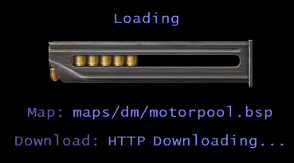
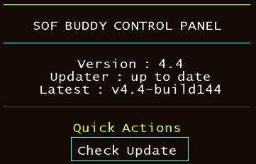

# SoF Buddy 🚀

<p align="center">
  <a href="LICENSE"></a>
  <a href="https://github.com/d3nd3/sof_buddy/releases"></a>
  <a href="https://discord.gg/zZjnsRKPEJ"></a>
  
  
</p>




> **A modern enhancement suite for Soldier of Fortune 1 — scaling, fixes, and quality-of-life improvements for the best SoF experience.**

---

### ⚠️ **#1 THING YOU NEED TO KNOW**

**Press `F12` in-game** (or bind a key to `sofbuddy_menu sof_buddy`). That opens the SoF Buddy menu — settings, updater, profiles, and everything else. **Do this first.** If you don’t, you’re missing the main way to use SoF Buddy.

---

## ✨ Features

<details open>
<summary><b>Click to expand</b></summary>

- 🔠 **Font Scaling** — Crisp, readable fonts at any resolution: `1x`, `2x`, `3x`, `4x`, etc. Enable **Auto Font Scale** (`_sofbuddy_font_scale_auto 1`) to track resolution (`vid_h / 480`), or turn auto off and set `_sofbuddy_font_scale` manually.
- 🖥️ **HUD Scaling** — Scale the HUD independently from the font for perfect UI balance. **Auto HUD Scale** (`_sofbuddy_hud_scale_auto 1`) uses the same resolution ratio; disable auto to pick a manual `_sofbuddy_hud_scale`.
- 🎬 **Cinematic Image Scaling** — Credit/fade images (`SP_FLAG_CREDIT`) scale up from 640×480 to your resolution. Toggle with `_sofbuddy_scale_cinematic_pics` (`1` = on, `0` = off) or **Scale Cinematic Images** in F12 → UI Scale.
- 🎯 **Crosshair Scaling** — Scale crosshair textures independently for improved visibility.
- 🎯 **Restored `cl_maxfps` in Singleplayer** — Enjoy smooth framerates without legacy workarounds. Editable from **F12 → CPU → Framerate** (whole-ms cap list + VSync).
- ⚡ **Stable Framerate & CPU Saver** — Uses `QueryPerformanceCounter` for precise timing and energy savings. New cvar: `_sofbuddy_sleep`.
- 🖱️ **Raw Mouse Input** — Direct hardware input bypassing Windows acceleration. All original sensitivity cvars still work!
- 🏷️ **Widescreen Teamicons GlitchFix** — Team icons are always correctly positioned, even in widescreen. Team icons and playernames above players scale with the HUD — toggle with `_sofbuddy_icons_autoscale` or **Icons Autoscale** in F12 → UI Scale.
- 🖼️ **HD Texture Support** — Native support for high-res `.m32` textures. [Learn more](https://www.sof1.org/viewtopic.php?p=45667)
- 🌙 **Lighting Blend Mode Adjustment** — Experience WhiteMagicRaven's lighting tweaks (optional).
- 🖲️ **Console Size Adjustment** — Set how much of the screen the console covers, for any setup.
- 🔄 **VSync Reliability** — `gl_swapinterval` is applied on every `vid_restart` for hassle-free vsync. F12 → CPU shows the measured display refresh, a request picker built from your driver's actual modes, plus a cap check that warns when VSync could deliver more than the framerate cap allows.
- 🛠️ **Sane Defaults on First Run** — Fixes bad config defaults after hardware changes.
- 🛡️ **Console Overflow/Crash Fixes** — No more crashes from large pastes or ultra-wide resolutions.
- 🧾 **Large `config.cfg` Exec Fix** — Avoid `Cbuf_AddText: overflow` when running `exec config.cfg` with very large configs.
- 🧩 **Embedded Loading / Internal Menus** — Serve RMF menu assets from memory (includes loading UI) and open internal pages via `sofbuddy_menu`.
- 🌐 **HTTP Map Download Assist** — Download missing maps over HTTP and resume precache; provider URLs configurable via cvars.
- ⬆️ **In-Game Updater + Startup Prompt** — Check/download release zips in-game, with optional startup check and internal-menu prompt.
- 🧓 **Windows XP Updater Mirror Defaults** — XP builds default updater feed URLs to `sofvault.org` (overrideable via cvars).
- 📚 **Feature Docs** — See `src/features/internal_menus/README.md`, `src/features/http_maps/README.md`, and `src/features/cbuf_limit_increase/README.md`.

</details>

---

## 🚀 Installation

<details>
<summary><b>Click to expand</b></summary>

### Recommended: Windows installer (easiest)

For Windows, the installer is the most effortless way to install SoF Buddy: it installs the
universal DLL, lets you choose features, and writes the runtime selection for you. No manual
extraction or feature-enable scripts are needed.

1. [Download the latest Windows installer](https://github.com/d3nd3/sof_buddy/releases) (`sof_buddy_setup.exe`).
2. Run it and select the SoF folder containing `SoF.exe`.
3. Keep **Recommended feature set** or choose **Custom feature selection**, then finish setup.
4. Setup automatically enables SoF Buddy and saves the original as `SoF.exe.bak`.
5. Launch SoF.

### Manual installation (Windows/Linux/Wine)

#### 1. Get SoF Buddy

- **Option A:** [Download a pre-compiled release](https://github.com/d3nd3/sof_buddy/releases)
- **Option B:** Compile from source:
  ```sh
  make               # Release build (optimized)
  make BUILD=xp      # Windows XP-targeted build
  make debug         # Debug build (with logging)
  make BUILD=xp-debug # XP-targeted debug build
  make debug-gdb     # Debug build with GDB breakpoint function
  make debug-collect # Debug build with func_parents collection
  ```
  See [docs/DEBUGGING.md](docs/DEBUGGING.md) for details on build configurations.

### 2. Prepare Your Game Folder

- **Recommended:** Delete your `User/config.cfg` for optimal defaults.
- Extract the release `.zip` directly into your SoF root (where `SoF.exe` lives). It contains:
  - `sof_buddy.dll` (goes in the SoF root)
  - `sof_buddy/` folder (created under the SoF root)
    - `sof_buddy/funcmaps/` (contains JSON function maps)
    - Windows: `sof_buddy/enable_*.cmd` scripts and `sof_buddy/patch_sof_binary.ps1`
    - Linux/Wine: `sof_buddy/enable_*.sh` scripts and `sof_buddy/patch_sof_binary.sh`
- Use the helper scripts to patch SoF.exe to load different DLLs:
  - `**enable_sofplus_and_buddy.cmd`** → Loads `sof_buddy.dll` (recommended: SoF Buddy + optional SoF Plus)
  - `**enable_sofplus.cmd`** → Loads `spcl.dll` (SoF Plus only, disables SoF Buddy)
  - `**enable_vanilla.cmd`** → Loads `WSOCK32.dll` (vanilla SoF, no mods)
  - `**update_from_zip.cmd**` → Extract newest downloaded SoF Buddy update zip (`sof_buddy/update/*.zip`) into SoF root
- SoF Buddy auto-loads `spcl.dll` if present, so it works *with* SoF Plus.

### Windows installer features

See [WINDOWS_INSTALLER.md](WINDOWS_INSTALLER.md) for the complete packaging,
runtime-selection, and updater behavior.

The Windows installer uses one universal DLL and writes the selected features to
`sof_buddy/features.cfg`; it does not compile a custom DLL for each installation.
GitHub publishes that universal channel separately as
`release_windows_universal.zip`; `release_windows.zip` remains the
compile-time/default channel, and the updater keeps those channels separate.
Its initial selections are generated from `features/FEATURES.txt`. The file can be
edited later (`feature` enables it, `// feature` disables it); restart SoF after changes.
If `features.cfg` is missing, the universal DLL falls back to those same defaults.
The F12 **Features** tab exposes the same choices at runtime as archived
`_sofbuddy_feature_<name>` cvars. Changes are written to `base/sofbuddy.cfg`,
shown as **Unavailable** when the installed non-universal DLL does not contain a
feature, and take effect after restarting SoF. On startup, those saved selections
are read before hooks are registered and synchronized back to
`sof_buddy/features.cfg`; that file remains the early-startup source of truth.
It also offers a separate **Installation options** checkbox page. The checked-by-default
**Apply Windows 10+ Application Compatibility fix** option verifies the known
SoF.exe PE layout, removes the `Raven Software` string at `0x2015F1C0`, and
saves the original as `SoF.exe.sofbuddy.bak`; unsupported executables are left
unchanged. **Unlock full violence** is also checked by default and is highly
recommended when not using SoFPlus's `spcl.dll`; it writes the SoF parental-control values
for the volume containing the selected game folder (using the password `sof`)
for the current Windows user. These per-user settings are left intact if SoF
Buddy is later uninstalled.

</details>

---

## 🕹️ Usage

<details>
<summary><b>Click to expand</b></summary>

### Enable SoF Buddy (Recommended)

- **Windows:** Run `sof_buddy/enable_sofplus_and_buddy.cmd`
- **Linux/Wine:** Run `sof_buddy/enable_sofplus_and_buddy.sh`
- This enables SoF Buddy and optionally loads SoF Plus (if `spcl.dll` is present)
- To apply a downloaded update zip, run:
  - **Windows:** `sof_buddy/update_from_zip.cmd`
  - **Linux/Wine:** `sof_buddy/update_from_zip.sh`

### Enable SoF Plus Only

- **Windows:** Run `sof_buddy/enable_sofplus.cmd`
- **Linux/Wine:** Run `sof_buddy/enable_sofplus.sh`
- This disables SoF Buddy and uses only SoF Plus

### Restore Vanilla SoF

- **Windows:** Run `sof_buddy/enable_vanilla.cmd`
- **Linux/Wine:** Run `sof_buddy/enable_vanilla.sh`
- This removes all mods and restores the original game

### In-Game Commands

- `**F12`** (or `**bind <key> sofbuddy_menu sof_buddy`**) — **Open the SoF Buddy menu. Use this. It’s the main entry point for all settings, updater, and profiles.** Under **UI Scale**: **Auto Font Scale** / **Auto HUD Scale** toggle `_sofbuddy_font_scale_auto` / `_sofbuddy_hud_scale_auto`; manual scale lists appear when auto is off. **Auto Round Scale** and **Scale Cinematic Images** are on the same page.
- `sofbuddy_list_features` — Print compiled features (and whether they are on/off).
- `sofbuddy_menu <name>` — Open an embedded internal menu page (examples: `loading`, `sof_buddy`).
- `sofbuddy_menu <menu>/<page>` — Open a specific embedded page (e.g. `sofbuddy_menu sof_buddy/cpu`).
- `sofbuddy_apply_menu_hotkey` — Re-apply bind from `_sofbuddy_menu_hotkey` (default `F12`).
- `sofbuddy_apply_profile_comp` — Apply competitive/low-visual profile preset.
- `sofbuddy_apply_profile_visual` — Apply visual/high-fidelity profile preset.
- `sofbuddy_update` — Check latest release from configured update API endpoint and compare with your current version.
- `sofbuddy_update download` — Download latest release zip to `sof_buddy/update/` (apply after closing game; release zips are preferred over debug zips).
- `sofbuddy_update_install` — Queue `sof_buddy/update_from_zip.cmd` via engine `start` and quit SoF.
- `sofbuddy_openurl <https_url>` — Open trusted community links in your default browser (used by the Social Links menu page).

</details>

---

## 🧓 Windows XP

<details>
<summary><b>Click to expand</b></summary>

- Use the **XP package** from releases (`release_windows_xp.zip`) or compile with:
  ```sh
  make BUILD=xp
  ```
- XP builds define `SOFBUDDY_XP_BUILD` and default updater endpoints to:
  - `_sofbuddy_update_api_url` = `http://sofvault.org/sof_buddy/releases/latest.json`
  - `_sofbuddy_update_releases_url` = `http://sofvault.org/sof_buddy/releases/latest`
- If you run your own mirror/proxy feed, override in console:
  ```cfg
  set _sofbuddy_update_api_url "http://your-endpoint/latest.json"
  set _sofbuddy_update_releases_url "http://your-endpoint/releases/latest"
  ```
- XP users may hit WinHTTP TLS failures on modern HTTPS endpoints (for example GitHub API). The mirror defaults above avoid that path.
- The sofvault host syncs the XP zip + `latest.json` from GitHub on a cron schedule (`rsrc/sofvault_mirror/sync_from_github.sh`); no SSH publish from CI is required.

</details>

---

## 🍷 Wine/Proton (Linux)

<details>
<summary><b>Click to expand</b></summary>

- **Recommendation:** Use Wine for best fullscreen experience and fewer visual glitches.
- **Launch Example:**
  ```sh
  wine SoF.exe +set console 1 +set cddir CDDIR #%command%
  ```
- **Proton Note:** Proton ≤ 4.11-13 recommended. Otherwise, adjust sound frequency each startup.
- **Raw Mouse Input (`_sofbuddy_rawmouse`):** For true raw mouse input (bypassing system acceleration), you need **Proton ≥ 9.0** or **GloriousEggroll's custom Proton builds**. Standard Wine/wine-staging may still apply system mouse acceleration.
- **Optimal FPS Tweaks:** Add to `base/autoexec.cfg`:
  ```
  cl_quads 0
  ghl_light_method 0
  ghl_shadows 0
  ```
  (Note: `cl_quads 0` disables many effects.)

</details>

---

## ⚙️ Cvars (Configuration Variables)

<details>
<summary><b>Click to expand</b></summary>

Every user-facing cvar is editable from **F12 → Cvars**, which shows the live value, the
default, and a description for each one. Use `set <name> <value>` in the console to script them.

Internal bookkeeping cvars (layout math, migration guards, runtime status read-outs) use the
`_sb_internal_` prefix and are listed separately at the bottom. Do not edit those by hand.

### User-facing

| Cvar | Default | Description |
| ---- | ------- | ----------- |
| `_sofbuddy_high_priority` | `1` | Set process priority to HIGH (`0` = NORMAL). F12 → CPU. |
| `_sofbuddy_sleep` | `1` | CPU-saving sleep between frames. F12 → CPU. |
| `_sofbuddy_sleep_jitter` | `0` | Frame time borrowing. Experimental; can worsen pacing, leave `0` unless needed. F12 → CPU. |
| `_sofbuddy_sleep_busyticks` | `2` | 1 ms busyloop ticks per frame. Lower saves CPU, `0` may stutter. F12 → CPU. |
| `_sofbuddy_perf_profile` | `0` | Perf preset: `0` Competitive, `1` High Visual, `2` Low Visual, `3` Custom/Current (view only). F12 → CPU. |
| `_sofbuddy_font_scale` | `1` | Manual font scale multiplier (`0.25` … `8` in 0.25 steps). Used when auto is `0`. F12 → UI Scale. |
| `_sofbuddy_font_scale_auto` | `1` | Auto font scale from `vid_h / 480`. `1` on, `0` off. Legacy `_sofbuddy_font_scale -1` migrates to auto on + scale `1`. F12 → UI Scale. |
| `_sofbuddy_hud_scale` | `1` | Manual HUD scale multiplier (`0.25` … `8` in 0.25 steps). Used when auto is `0`. F12 → UI Scale. |
| `_sofbuddy_hud_scale_auto` | `1` | Auto HUD scale from `vid_h / 480`. `1` on, `0` off. Legacy `_sofbuddy_hud_scale -1` migrates like font auto. F12 → UI Scale. |
| `_sofbuddy_scale_round_auto` | `0` | Snap auto font/HUD scale to round steps instead of a continuous ratio. `1` on, `0` off. F12 → UI Scale. |
| `_sofbuddy_scale_round_ratio` | `0.25` | Snap increment used when round auto is on (`0.05`, `0.1`, `0.125`, `0.25`, `0.5`, `1`). Also applies to cinematic image scaling. F12 → UI Scale. |
| `_sofbuddy_scale_cinematic_pics` | `1` | Scale cinematic credit/fade images (`SP_FLAG_CREDIT` / `SCR_DrawCinemaScope`) up from 640×480. `1` on, `0` off. F12 → UI Scale. |
| `_sofbuddy_crossh_scale` | `1` | Crosshair size multiplier. F12 → UI Scale. |
| `_sofbuddy_icons_autoscale` | `1` | Scale team icons and playernames drawn above players with the HUD scale. `1` on, `0` off. F12 → UI Scale. |
| `_sofbuddy_console_size` | `0.5` | Console height as a fraction of screen height (`0`–`1`, `1` = fullscreen). F12 → UI Scale. |
| `_sofbuddy_minfilter_unmipped` | `GL_LINEAR` | Min filter for sky and other unmipped textures. `GL_NEAREST` or `GL_LINEAR` (mipmap modes make textures incomplete). F12 → Texture. |
| `_sofbuddy_magfilter_unmipped` | `GL_LINEAR` | Mag filter for sky and other unmipped textures. F12 → Texture. |
| `_sofbuddy_minfilter_mipped` | `GL_LINEAR_MIPMAP_LINEAR` | Min filter for mipmapped textures. F12 → Texture. |
| `_sofbuddy_magfilter_mipped` | `GL_LINEAR` | Mag filter for mipmapped textures. F12 → Texture. |
| `_sofbuddy_minfilter_ui` | `GL_NEAREST` | Min filter for UI textures. Keep `GL_NEAREST` — LINEAR makes fonts unreadable. F12 → Texture. |
| `_sofbuddy_magfilter_ui` | `GL_NEAREST` | Mag filter for UI textures. Keep `GL_NEAREST` — LINEAR makes fonts unreadable. F12 → Texture. |
| `_sofbuddy_lighting_overbright` | `0` | Overbright lighting. `1` on. When on, it overrides the manual blend cvars below. F12 → Lighting. |
| `_sofbuddy_lighting_cutoff` | `64` | Lighting cutoff value. F12 → Lighting. |
| `_sofbuddy_water_size` | `64` | Warp polygon size — energy swirl frequency. Smaller is faster, minimum `16`. F12 → Lighting. |
| `_sofbuddy_lightblend_src` | `GL_ZERO` | Lightmap blend source. Experimental, leave at default. F12 → Lighting. |
| `_sofbuddy_lightblend_dst` | `GL_SRC_COLOR` | Lightmap blend destination. Experimental, leave at default. F12 → Lighting. |
| `_sofbuddy_shiny_spherical` | `1` | Let shiny `gl_detailtexturing` change with view angle. `1` on, `0` off. F12 → Lighting. |
| `_sofbuddy_rawmouse` | `0` | Raw mouse input via the Raw Input API, bypassing Windows pointer acceleration. `1` on, `0` off. |
| `_sofbuddy_http_maps` | `1` | HTTP map assist: `0` Off, `1` Primary, `2` Random provider, `3` Rotate providers. |
| `_sofbuddy_http_maps_dl_1` | `https://sofvault.org/sof1maps` | Zip download base URL, provider slot 1. |
| `_sofbuddy_http_maps_dl_2` | `https://raw.githubusercontent.com/plowsof/sof1maps/main` | Zip download base URL, provider slot 2. |
| `_sofbuddy_http_maps_dl_3` | *(empty)* | Zip download base URL, provider slot 3. |
| `_sofbuddy_http_maps_crc_1` | `https://sofvault.org/sof1maps` | CRC lookup base URL, slot 1 (HTTP Range fetch of the zip central directory). |
| `_sofbuddy_http_maps_crc_2` | `https://raw.githubusercontent.com/plowsof/sof1maps/main` | CRC lookup base URL, slot 2. |
| `_sofbuddy_http_maps_crc_3` | *(empty)* | CRC lookup base URL, slot 3. |
| `_sofbuddy_http_show_providers` | `0` | Show the provider + updater URL inputs on the Network tab. `1` show, `0` hide. |
| `_sofbuddy_update_check_startup` | `1` | Run the updater check at startup and open the internal prompt when a newer release is found. |
| `_sofbuddy_update_api_url` | build-dependent | Updater JSON feed URL. XP builds default to the sofvault mirror, non-XP to the GitHub API. |
| `_sofbuddy_update_releases_url` | build-dependent | Human release page URL shown in updater status/help. |
| `_sofbuddy_update_target_tag` | `latest` | Release tag to install. Refresh the list on the Updates tab after changing. |
| `_sofbuddy_menu_hotkey` | `F12` | Key that opens the menu. After changing, run `sofbuddy_apply_menu_hotkey` in the console. |
| `_sofbuddy_menu_theme` | `0` | Menu color preset (`0` … `37`). Reopen the menu to apply. |
| `_sofbuddy_loading_lock_input` | `0` | Lock game input while the loading screen is up. `1` locked, `0` unlocked. |
| `_sofbuddy_loading_show_mapname` | `1` | Show the current map name on the loading screen header. `1` on, `0` off. |
| `_sofbuddy_loading_show_download` | `1` | Show HTTP/download status on the loading screen header. `1` on, `0` off. |
| `_sofbuddy_entity_edit` | `0` | **Map entity / map study tools (off by default):** set `1` to enable the spawn **cache** during load, `sofbuddy_entities_draw` / `ev_debugbox`, and **primary-attack intersect**. Nothing in this feature runs until this is on — see [Map entity wireframes](src/features/entity_visualizer/README.md#map-entity-wireframes-how-it-works) |
| `_sofbuddy_entities_draw_verbose` | `0` | Log one line per entity when `sofbuddy_entities_draw` runs. |
| `_sofbuddy_map_debug_map` | *(empty)* | Map stem for Map study load + spawn recording, no path and no `.bsp` (e.g. `moscow`). |
| `_sofbuddy_map_study_deathmatch` | `4` | `deathmatch` mode applied before the map loads. `4` = CTF, which suits most map testing. |

The four `_sofbuddy_entity_edit` / `_sofbuddy_entities_draw_verbose` / `_sofbuddy_map_debug_map` /
`_sofbuddy_map_study_deathmatch` cvars come from the `entity_visualizer` feature, which is
**disabled by default** in `features/FEATURES.txt`. In a default build they are never registered,
so they do not appear in the console and the **Map Study** section is hidden from the Cvars tab
(gated on `_sb_internal_feature_entity_visualizer` via `<cinclude>`). Enable that feature to get
them.

- See [OpenGL glBlendFunc docs](https://www.khronos.org/registry/OpenGL-Refpages/gl4/html/glBlendFunc.xhtml) for blend values.
- Cvars with `CVAR_SOFBUDDY_ARCHIVE` persist to `base/sofbuddy.cfg` and are reapplied on startup.

### Server-visible client info

| Cvar | Purpose |
| ---- | ------- |
| `_sp_cl_info_sofbuddy` | `windows-<version>-<build>`, `wine-<version>-<build>`, or `universal-<version>-<build>`, sent with client userinfo so a server can identify the SoF Buddy channel. |

The build number is the GitHub Actions run number; local builds use `local`.
This is informational client metadata, not an anti-cheat signal.

### Internal (`_sb_internal_`)

Written by sof_buddy itself. Values are recomputed each launch, so editing them has no lasting effect.

| Cvar | Purpose |
| ---- | ------- |
| `_sb_internal_version` | Build version string, reported on the Home and Updates tabs. |
| `_sb_internal_tab` / `_sb_internal_menu_last_page` | Remembered tab index and last opened page. |
| `_sb_internal_menu_vid_w` / `_sb_internal_menu_vid_h` | Cached engine `vid_w` / `vid_h` used to recompute menu layout cvars. |
| `_sb_internal_center_panel_px`, `_sb_internal_tabs_row1_*`, `_sb_internal_tabs_row2_*` | Computed tab-bar layout: panel width, prefixes/suffixes, content width and bias. Recomputed on resolution change. |
| `_sb_internal_profile_target_*` | "Will set…" preview values shown on the CPU tab for the perf profile. |
| `_sb_internal_font_scale_rounded` / `_sb_internal_hud_scale_rounded` | Read-only mirror of the effective scale after ratio and glyph-grid rounding. |
| `_sb_internal_font_scale_auto_migrated` / `_sb_internal_hud_scale_auto_migrated` | One-shot guards so the legacy `-1` auto-scale migration runs once. |
| `_sb_internal_loading_progress` / `_sb_internal_loading_current` / `_sb_internal_loading_status` / `_sb_internal_loading_network` | Runtime loading-screen state and status text. |
| `_sb_internal_loading_zip_indicator` | Pic path for the loading-screen download indicator. |
| `_sb_internal_update_status` / `_sb_internal_update_latest` / `_sb_internal_update_download_path` / `_sb_internal_update_downloaded_asset` / `_sb_internal_update_checked_utc` | Updater progress read-outs shown on the Updates tab. |
| `_sb_internal_update_release_list_rmf` / `_sb_internal_update_release_list_status` | Generated RMF markup for the release list, plus its load status. |
| `_sb_internal_feature_entity_visualizer` | Compile-time build flag (`1`/`0`) used by `<cinclude>` to hide menu sections whose feature is not compiled in. |
| `_sb_internal_openurl_status` / `_sb_internal_openurl_last` | Last social-link open result and requested URL. |

</details>

---

## Releasing (maintainers)

See **[RELEASE_INSTRUCTIONS.md](RELEASE_INSTRUCTIONS.md)** for the full manual guide.

SoF Buddy uses two version numbers:

| Part | Where | Example |
|------|--------|---------|
| **Version** (`MAJOR.MINOR`) | `VERSION` file (bump manually) | `8.1` |
| **Build** | GitHub Actions `run_number` (automatic) | `189` |

Published tags look like **`v8.1-build189`**. Pushing to `master` always builds; a **GitHub Release is created only when `VERSION` changes** in that commit.

**Cut a release:**

```sh
./.cursor/skills/new-release/scripts/new_release.sh          # bump VERSION, stage hdr/version.h
# update CHANGELOG.md with ## vX.Y
./.cursor/skills/new-release/scripts/new_release.sh --check  # verify bump + changelog
./.cursor/skills/new-release/scripts/new_release.sh --commit -m "Release vX.Y: summary"
```

`--commit` runs `--check` automatically. Feature fixes on `master` without a `VERSION` bump still CI-build but do not publish a new GitHub release.

---

## 🤝 Credits

- **WhiteMagicRaven** — Lighting blend mode
- **Acadie** — Endless knowledge
- **d3nd3** — Project lead
- **Community** — Bug reports, testing, and support

---

## 📄 License

This project is licensed under the MIT License. See [LICENSE](LICENSE) for details.

---

## 💬 Need Help?

- [Open an issue](https://github.com/d3nd3/sof_buddy/issues)
- [SoF1.org Forums](https://www.sof1.org/)
- **Discord Server:** [Join our Discord](https://discord.gg/zZjnsRKPEJ)

---

> *SoF Buddy is not affiliated with Raven Software or Activision. Soldier of Fortune is © their respective owners.* 

